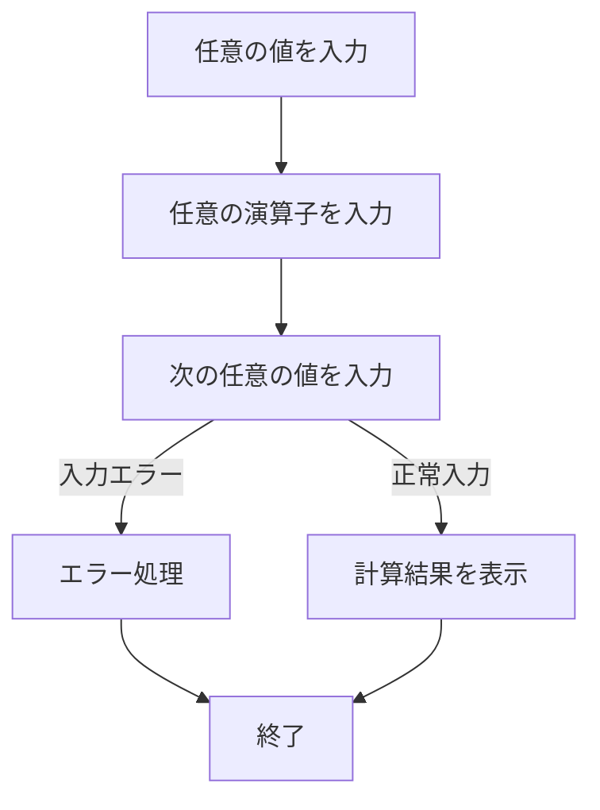

# 電卓ツール

## 処理フロー



## 機能 (優先レベル順)
- [ ] 連続計算
```
連続して計算できるようにする（繰り返し処理で実現）
```

- [ ] エラー処理からの回帰処理
```
無効入力時に再入力できるようにする
```

- [ ] 計算終了/戻る機能
```
"e" で計算を終了、"r" で1回前の処理に戻る
```

- [ ] 次回計算の自動準備
```
計算終了後、自動で次の計算の準備をする
```

- [ ] 計算の高速化
```
並列処理やライブラリ導入などで計算を高速化する
```

- [ ] 高度な計算
```
桁数の多い値や四則演算以外の計算に対応する
```

---

- [x] 四則演算
- [x] 少数を含む計算
- [x] エラー表示