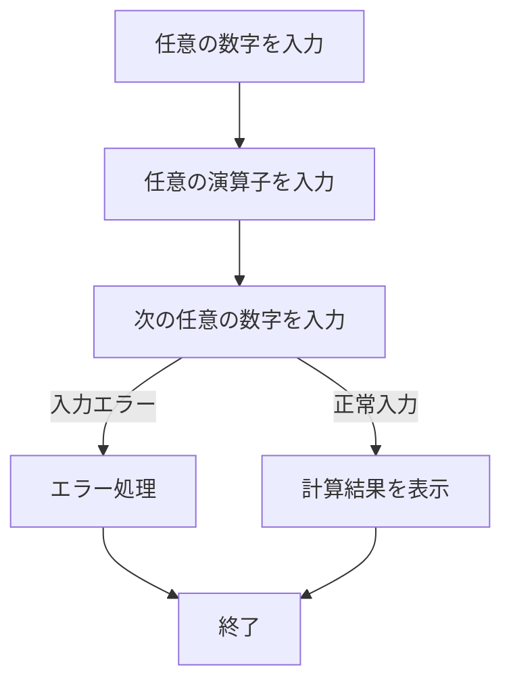

# 電卓ツール

## ユーザーフロー

```mermaid
flowchart TD
    A[任意の数字を入力]
    B[任意の演算子を入力]
    C[次の任意の数字を入力]
    D[計算結果を表示]
    E[エラー処理]
    F[終了]

    A --> B --> C
    C -->|入力エラー| E --> F
    C -->|正常入力| D --> F
```

## 処理フロー

```mermaid
flowchart TD
    
```