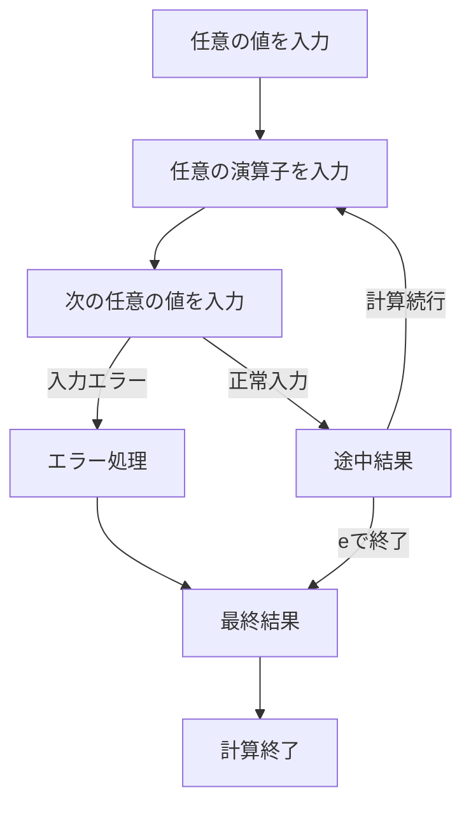

# 電卓ツール

## 処理フロー

```mermaid
flowchart TD
    A[任意の値を入力]
    B[任意の演算子を入力]
    C[次の任意の値を入力]
    D[途中結果]
    E[エラー処理]
    F[最終結果]
    G[計算終了]

    A --> B --> C
    D --> |計算続行|B
    C --> |入力エラー|E --> F
    C --> |正常入力|D -->|eで終了| F
    F --> G
```
