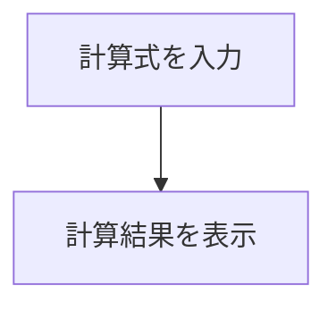

# 電卓ツール

## 処理フロー

```mermaid
flowchart TD
    A[計算式を入力]
    B[計算結果を表示]

    A --> B
```

## 学んだこと
- Pythonの基本文法(演算、)
- eval() の使い方

## 参考文献
1. [JavaScriptでeval関数の使い方とリスクとは【初心者向け】](https://magazine.techacademy.jp/magazine/15038)

